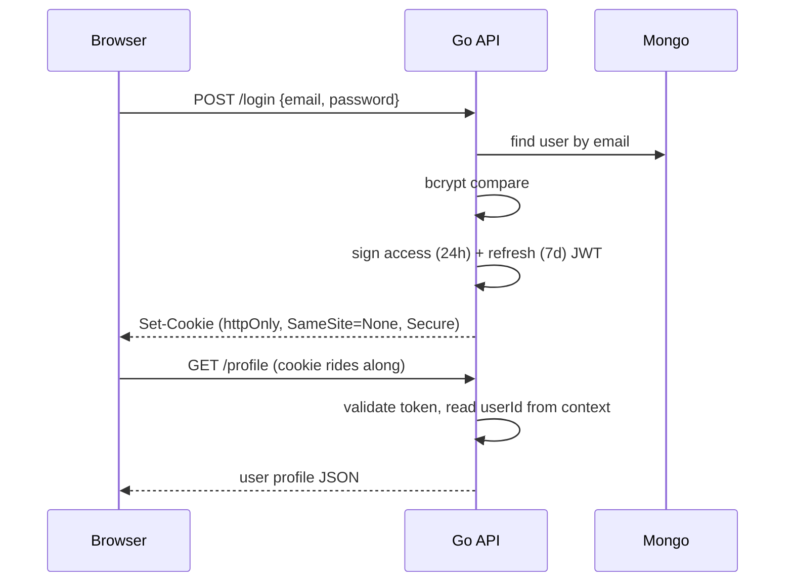

# Architecture

MagicStream is a fairly classic two-tier app: a Go/HTTP API talking to MongoDB,
and a React SPA that talks to it through a dev proxy. There's no gateway, no
message queue, no microservices — because a catalog browser with
recommendations genuinely doesn't need them, and pretending otherwise makes the
code worse to read.

## The pieces

```
┌──────────────┐   /api (Vite proxy)   ┌──────────────────┐   mongo-driver   ┌──────────┐
│  React SPA   │ ───────────────────► │  Gin API          │ ───────────────► │ MongoDB  │
│  Client/     │ ◄─────────────────── │  Server/          │ ◄─────────────── │          │
└──────────────┘     JSON + cookies   └──────────────────┘                   └──────────┘
                                      │   ├─ middleware chain
                                      │   ├─ controllers
                                      │   └─ utils (JWT)
```

- **Client** — Vite + React 19 + TypeScript. Plain CSS, no UI framework. Auth
  state lives in a React context; every request sends `credentials: include` so
  the httpOnly cookies ride along.
- **API** — Gin. Each handler is a closure that captures the Mongo client,
  which keeps the route setup explicit and the handlers easy to test.
- **Mongo** — one database, three main collections: `users`, `movies`,
  `genres`, plus `rankings` used by the AI review ranking flow.

## Request lifecycle

Every request passes through the middleware chain in `server.go`:

```
RequestID → Logger → CORS → (route group limiter) → (AuthMiddleware?) → handler
```

1. **RequestID** stamps the request and echoes `X-Request-ID` back, so a single
   user journey can be traced through the logs.
2. **Logger** writes one structured JSON line per request with status, latency,
   client IP and that request ID.
3. **CORS** allows the configured origins with credentials.
4. **Rate limiter** — a token bucket keyed by client IP. Public routes get a
   generous limit; the auth routes (`/user`, `/login`, `/refreshtoken`) get a
   tight one to slow down password guessing.
5. **AuthMiddleware** (protected group only) validates the access token from the
   cookie and puts `userId` + `role` into the context. Admin routes additionally
   run through `AdminOnly`.

Handlers never parse the token themselves — they read `userId`/`role` from the
context via `utils.GetUserIdFromContext` / `GetRoleFromContext`.

## Auth flow



- Passwords are hashed with bcrypt at the default cost.
- The access token carries the user's email, name, role and user id. Role is
  the thing that gates admin endpoints.
- Registration **forces** `role = USER`; a client-supplied role is ignored.
- Tokens are also mirrored into the user document so a session can be revoked
  by clearing them (which is what logout does).

## Recommendations

`/recommendedmovies` (logged-in only):

1. Read `favourite_genres` from the user document.
2. Query movies where `genre.genre_name ∈ favourite_genres`.
3. Sort by `ranking.ranking_value` ascending (1 = Must Watch), cap at
   `RECOMMENDED_MOVIE_LIMIT` (default 5).

It's a deliberately simple content-based recommender — no collaborative
filtering, no embedding model. That keeps the dependency surface small and the
behaviour explainable. The roadmap lists the fancier options.

## AI review ranking

Admins can set a free-text review on a movie. The server then asks OpenAI to
classify the review into one of the ranking names from the `rankings`
collection (skipping the `999`/Not Ranked sentinel), and stores both the review
and the resulting `ranking_value` on the movie.

The prompt template comes from `BASE_PROMPT_TEMPLATE` in the environment; the
available ranking names are injected into it, so adding a ranking in the DB
changes what the model is allowed to answer with — without a redeploy.

If `OPENAI_API_KEY` is missing, the endpoint returns 500 and the admin UI shows
a helpful hint instead of an obscure error.

## Streaming

`GET /media/:file` serves files from `MEDIA_DIR` (default `./media`):

- The path is cleaned and checked to stay inside the media directory, so
  `../` traversal gets a 403.
- `c.File()` handles `Content-Type` sniffing and HTTP `Range` headers, which is
  what lets the `<video>` element seek around a clip instead of downloading it
  wholesale.

A few seconds of generated test video ship in the repo so the feature works
before you drop in your own files.

## Why no framework wrappers

No ORM, no DI container, no codegen. The data layer is thin (`database` package
returns `*mongo.Collection`), handlers get the client injected at route-setup
time, and interfaces are used where they earn their keep. For a project this
size, that keeps the stack-trace distance between a bug and its fix short.
